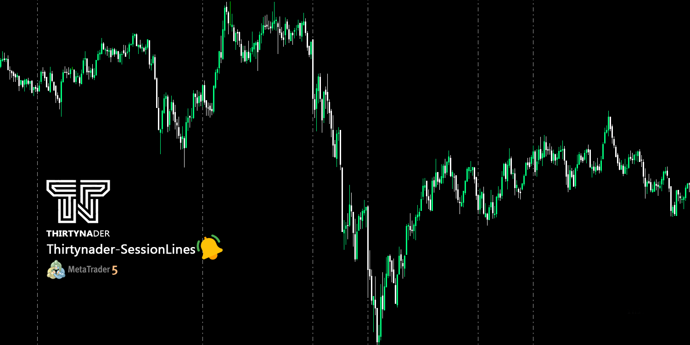
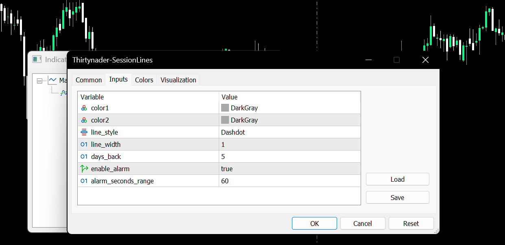

# 📊 Thirtynader SessionLines Indicator for MetaTrader 5

A smart and efficient indicator that automatically draws trading session lines, helping you detect **potential trend reversal zones** with high accuracy.

---

## ✨ Features

- 🔁 Automatically draws session-based horizontal lines
- ⏰ Works across all timeframes and assets
- 🎯 Designed to detect **key reversal areas**
- 🔔 Built-in **alert system**, so you never miss a trading opportunity
- 🎨 Fully customizable appearance

---

## 🧠 How It Works

The session lines act as psychological support and resistance zones, derived from key market hours.

📌 **When the price touches these lines, there's a high probability of trend reversal or temporary pullback.** These levels are based on historical session behaviors, offering high-probability trade setups for scalpers and swing traders alike.

🚨 **The integrated alert feature ensures you are notified instantly**, so you never miss a potential setup — even when you're away from the screen.

📊 In many cases, when price reaches one of these session zones, you’ll observe a **clear behavioral shift** in the market — such as:
- A reversal in trend direction
- A turning point in market cycles
- The beginning of a breakout move

These moments can provide early entry or exit signals for high-probability trades.

---

## 📦 Installation

1. Download the file: [`Thirtynader-SessionLines.ex5`](https://github.com/Thirtynader/Thirtynader-SessionLines/releases/latest/download/Thirtynader-SessionLines.ex5)
2. Open MetaTrader 5
3. Go to `File → Open Data Folder`
4. Navigate to: `MQL5/Indicators/`
5. Copy the file there and restart MetaTrader
6. Attach the indicator to any chart

---

## 📸 Screenshots

## Thirtynader-SessionLines 📈

  
*Live chart showing Thirtynader-SessionLines in action with clear session boundaries.*

  
*Customizable indicator settings, including session colors, line style, and alert system.*

---

## 🔒 Note

This release includes only the **compiled .ex5** file. The source code is not publicly available in order to protect proprietary logic.

---

## 📬 Contact

For questions, feedback, or collaboration:

📧 Thirtynader@gmail.com  
📢 Follow updates on: https://www.1hesekhob.com/pages/Thirtynader/
                       https://github.com/Thirtynader
---

## ⚖ License

MIT License (Optional) — Free for personal and commercial use, redistribution of compiled version only.
