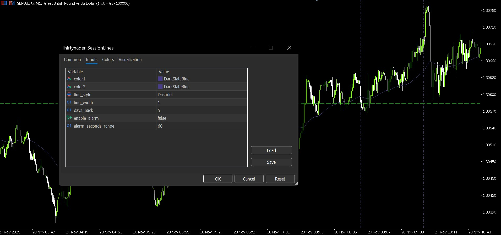

# 📊 Thirtynader SessionLines Indicator for MetaTrader 5

A MetaTrader 5 indicator that draws vertical lines at specific session times with built-in alerts.

## Features

- **10 Session Time Markers**: Displays vertical lines at predefined trading session times
- **Customizable Appearance**: Adjustable colors, line styles, and width
- **Time-based Alerts**: Optional alarm notifications when approaching session times
- **Multi-day View**: Shows lines for the last 5 days (configurable)
- **Optimized for MT5**: Uses MT5 native functions and best practices

## Installation

1. Copy the `.mq5` file to your MetaTrader 5 `Indicators` folder
2. Restart MT5 or compile the indicator
3. Drag and drop onto any chart

## Settings

| Parameter | Description | Default |
|-----------|-------------|---------|
| `color1` | Primary line color | Dark Gray |
| `color2` | Secondary line color | Dark Gray |
| `line_style` | Line style (solid, dash, dot, etc.) | Dash-Dot |
| `line_width` | Line thickness | 1 |
| `days_back` | Number of past days to display | 5 |
| `enable_alarm` | Enable/disable time alerts | true |
| `alarm_seconds_range` | Alert trigger range in seconds | 60 |

## Session Times (UTC)

The indicator marks these times daily:
- 09:00, 10:00, 14:00, 15:30, 16:30, 17:00, 18:00, 18:30, 21:00, 23:00

## Notes

- Times are based on your broker's server time
- Alerts trigger once per session per day
- Lines automatically update every 30 seconds
- Lines are non-selectable and hidden from object list for cleaner charts

## Requirements

- MetaTrader 5 platform

## License

Free to use and modify.

---

**Version**: 1.0  
**Platform**: MetaTrader 5

---

## 📦 Installation

1. Download the file: [`Thirtynader-SessionLines.ex5`](https://github.com/Thirtynader/Thirtynader-SessionLines/releases)
2. Open MetaTrader 5
3. Go to `File → Open Data Folder`
4. Navigate to: `MQL5/Indicators/`
5. Copy the file there and restart MetaTrader
6. Attach the indicator to any chart

---

## 📸 Screenshots

## Thirtynader-SessionLines 📈

  
*Customizable indicator settings, including session colors, line style, and alert system.*

