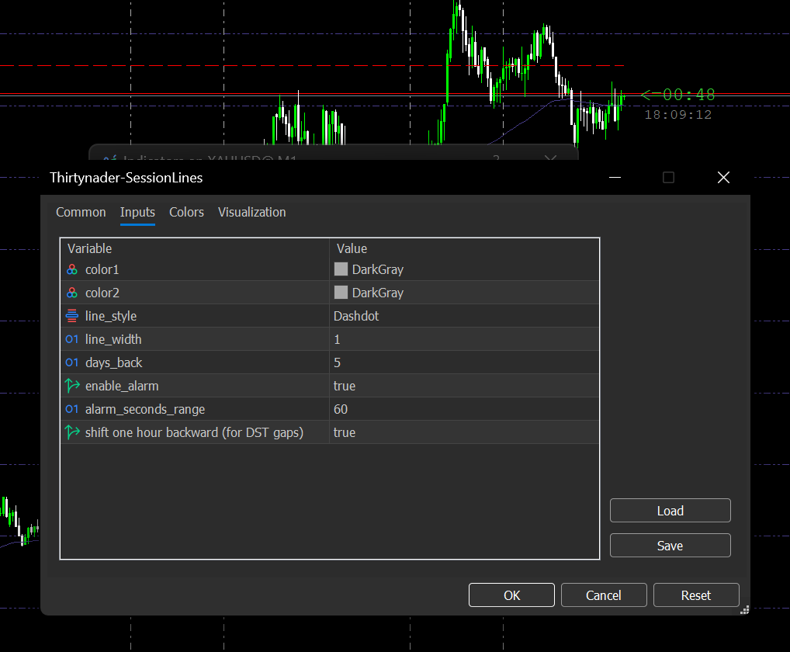

# 📊 Thirtynader SessionLines Indicator for MetaTrader 5

A smart and efficient indicator that automatically draws trading session lines, helping you detect **potential trend reversal zones** with high accuracy.

---
**Version History**: 
## ✨ V1.0.0

- 🔁 Automatically draws session-based horizontal lines
- ⏰ Works across all timeframes and assets
- 🎯 Designed to detect **key reversal areas**
- 🔔 Built-in **alert system**, so you never miss a trading opportunity
- 🎨 Fully customizable appearance
## Daylight Saving Time (DST) Adjustment
Overview

This indicator includes a built-in feature to handle the temporary time differences that occur during DST transition periods between the United States and Europe/Cyprus.
Background

Due to different DST schedules:

-     United States: DST starts on the second Sunday of March and ends on the first Sunday of November (UTC-5 → UTC-4)
-     Europe/Cyprus: DST starts on the last Sunday of March and ends on the last Sunday of October (UTC+2 → UTC+3)
- 

This creates two short periods each year where the time difference changes temporarily:

Spring gap: Between the second Sunday and last Sunday of March (~2 weeks)

Fall gap: Between the first Sunday of November and last Sunday of October (~1 week)

During these periods, the time difference between New York and Cyprus shifts from 7 hours to 6 hours.

Practical Impact for Traders

When the New York Stock Exchange opens at 9:30 AM EST:

Normal period: Opens at 4:30 PM Cyprus time

DST gap period: Opens at 3:30 PM Cyprus time (one hour earlier)

Settings

Normal trading periods: Keep shift_one_hour_back = false (default)

During DST gap periods: Set shift_one_hour_back = true

When enabled, all session lines will shift one hour backward to reflect the temporary 6-hour time difference.

Example

If you're trading from Cyprus and want to see accurate New York session times:

-     Enable shift_one_hour_back = true during mid-March to late-March
-     Disable it after the last Sunday of March
-     Re-enable it from early November to late October
-     Disable it after the last Sunday of October

This ensures your session lines always reflect the actual market opening times in your local timezone.

### Interactive Tooltips
- Hover your mouse over any vertical line to see the exact session time
- Tooltip displays the date and time in a readable format
- Helps quickly identify which session each line represents

## Usage Example

When daylight saving time begins or ends and your session lines appear shifted:

1. Open the indicator settings
2. Toggle `shift_one_hour_forward` to `true` or `false`
3. The lines will automatically adjust by one hour

## Configuration

| Parameter | Type | Default | Description |
|-----------|------|---------|-------------|
| shift_one_hour_forward | bool | false | Shifts all session lines forward by 1 hour when enabled |

---

## 🧠 How It Works

The session lines act as psychological support and resistance zones, derived from key market hours.

📌 **When the price touches these lines, there's a high probability of trend reversal or temporary pullback.** These levels are based on historical session behaviors, offering high-probability trade setups for scalpers and swing traders alike.

🚨 **The integrated alert feature ensures you are notified instantly**, so you never miss a potential setup - even when you're away from the screen.

📊 In many cases, when price reaches one of these session zones, you’ll observe a **clear behavioral shift** in the market - such as:
- A reversal in trend direction
- A turning point in market cycles
- The beginning of a breakout move

These moments can provide early entry or exit signals for high-probability trades.

---

## 📦 Installation

1. Download the file: [`Thirtynader-SessionLines.ex5`](https://github.com/Thirtynader/Thirtynader-SessionLines/releases)
2. Open MetaTrader 5
3. Go to `File → Open Data Folder`
4. Navigate to: `MQL5/Indicators/`
5. Copy the file there and restart MetaTrader
6. Attach the indicator to any chart

---

## 📸 Screenshots

## Thirtynader-SessionLines 📈

  
*Live chart showing Thirtynader-SessionLines in action with clear session boundaries.*

  
*Customizable indicator settings, including session colors, line style, and alert system.*

---

## 🔒 Note

This release includes only the **compiled .ex5** file. The source code is not publicly available in order to protect proprietary logic.

---

## 📬 Contact

For questions, feedback, or collaboration:

📧 Thirtynader@gmail.com  
📢 Follow updates on: https://www.1hesekhob.com/pages/Thirtynader/
                       https://github.com/Thirtynader
---

## ⚖ License

MIT License (Optional) — Free for personal and commercial use, redistribution of compiled version only.
